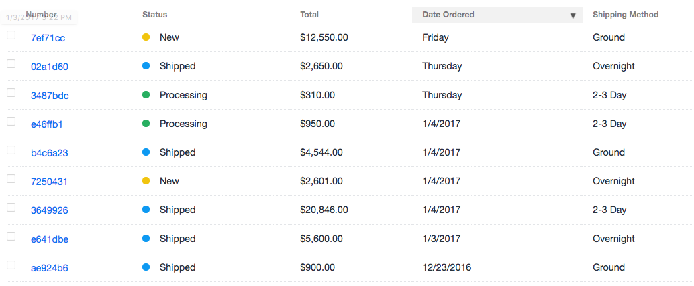

# Commerce CP Tweaks plugin for Craft CMS

Add a Shipping Method column to the order table display in the control panel.

## Installation

To install Commerce CP Tweaks, follow these steps:

1. Download & unzip the file and place the `commercecptweaks` directory into your `craft/plugins` directory
2.  -OR- do a `git clone https://github.com/surprisehighway/commercecptweaks.git` directly into your `craft/plugins` folder.  You can then update it with `git pull`
3.  -OR- install with Composer via `composer require surprisehighway/commercecptweaks`
4. Install plugin in the Craft Control Panel under Settings > Plugins

## Commerce CP Tweaks Overview

For now the plugin just adds the ability to add the Shipping Method to the order table. It can be easily customized for your own needs.

## Using Commerce CP Tweaks

In the ‘Commerce > Orders’ section of the control panel click the icon to customize the table columns. Check the ‘Shipping Method’ checkbox and click ‘Save’. The name of the Shipping Method will be displayed in the column. If the stored shipping method is no longer available the original shipping method's handle will be displayed instead.

## Commerce CP Tweaks Changelog

### 1.0.0 -- 2017.01.11

* Initial release

Brought to you by [Surprise Highway](http://surprisehighway.com)
